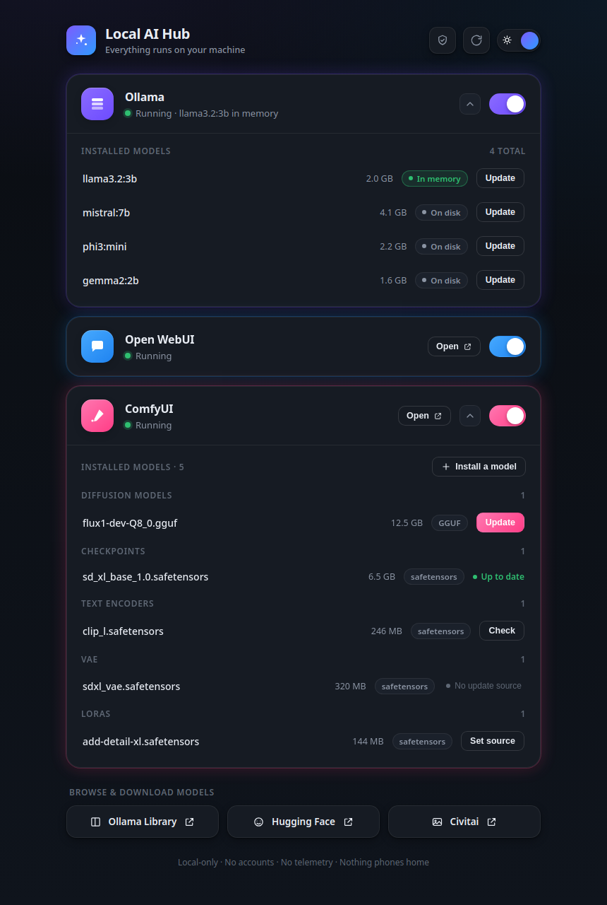
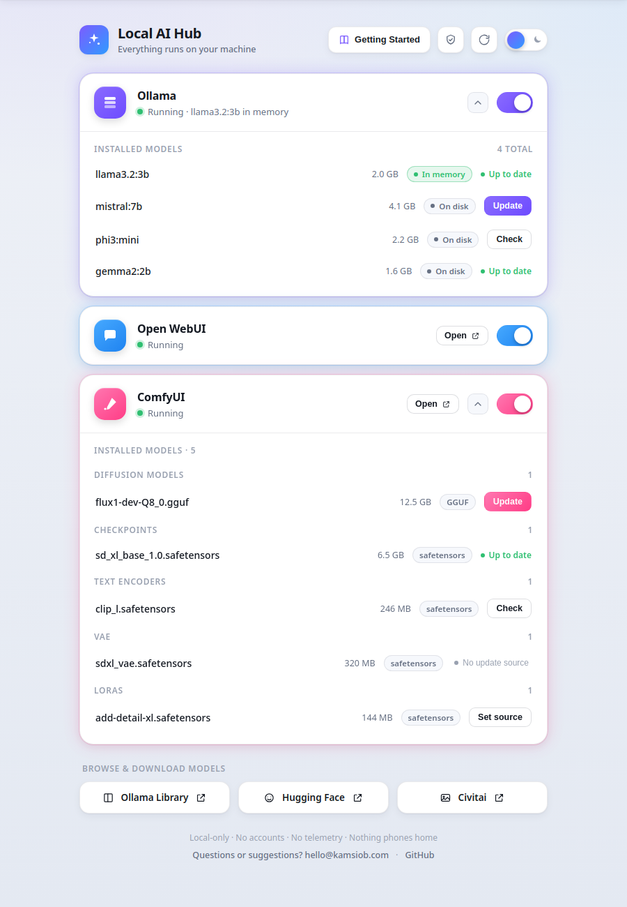

<h1 align="center">Local AI Hub</h1>

<p align="center">
  A premium desktop control panel for the AI services running <b>locally</b> on your machine —
  <a href="https://ollama.com">Ollama</a>, <a href="https://openwebui.com">Open&nbsp;WebUI</a>,
  and <a href="https://github.com/comfyanonymous/ComfyUI">ComfyUI</a>.
  Start/stop each service, watch live status, and manage models — all from one place.
</p>

<p align="center">
  <a href="LICENSE"></a>
  
  
  
</p>

<p align="center">
  
  &nbsp;
  
</p>

> **Everything stays local. No accounts, no telemetry, no analytics, nothing phones home.**
> The only outbound actions are the "browse models" links and model updates — and updates
> only contact that model's own host, only when you click.

---

## ⚙️ Tested on

This is built and proven on one specific configuration:

- **Distro:** Bazzite (Fedora Atomic base, KDE)
- **Hardware:** AMD Ryzen AI MAX+ 395 "Strix Halo", Radeon 8060S iGPU (**gfx1151**)
- **Services:** Ollama · Open WebUI · ComfyUI

Other distros, GPUs, or AI tools **aren't supported yet** — not a promise they won't be,
just an honest label. The app's built-in **Setup Check** detects whether your machine
matches and skips the checks plainly if it doesn't.

## 🚀 New here? Start with the guide

**→ [docs/GETTING_STARTED.md](docs/GETTING_STARTED.md)** — a from-scratch setup for the same
Bazzite + Strix Halo hardware, with two tracks: one for people using an AI assistant, and a
full manual walkthrough (every command verified against a working machine).

## ✨ Features

- **One toggle per service** — start/stop Ollama, Open WebUI, ComfyUI (systemd `--user`), live status.
- **Open in browser** — one click to each running web UI, always via `127.0.0.1` (never `localhost`).
- **Ollama model manager** — installed models with size, an **in-memory vs on-disk** badge, and a real `ollama pull` **Update**.
- **ComfyUI model manager** — lists what's in your model folders by type; **install** new models from a Hugging Face / Civitai / direct link (download → verify → filed in the right folder); per-model **Update** once a source is set.
- **Setup Check** — one panel that verifies the iGPU flags, the Open WebUI Quadlet, the gfx1151 ROCm build, and the GGUF node — with safe one-click fixes.
- **Crash-aware** — a service that dies shows **"Stopped unexpectedly"** with a **View log** button, not a silent gray.
- **Live rescan** — auto + manual, so hand-added models appear without a restart.
- **Light & dark** — polished, and your choice persists.

## 🖥️ Run it

```bash
python3 -m venv .venv
source .venv/bin/activate
pip install -r requirements.txt
python app.py
```

**Add it to your app launcher** (icon + pinnable, no terminal):

```bash
bash scripts/install-desktop.sh
```

This renders the app icon into `~/.local/share/icons` and installs a `.desktop`
entry that runs the app through the venv — double-clicking just works.

## 🏗️ Architecture

- **UI** — a local web front-end (`web/`) in a `QWebEngineView` (PySide6 + QtWebEngine), wired to Python over `QWebChannel`.
- **Backend** — `hub/services/` controls each service via `systemctl --user` + HTTP probes; Ollama uses its REST API, ComfyUI model provenance/updates live in `hub/services/comfy_models.py`. Stdlib only.
- **Adapting to another machine** — service unit names and ports are in `hub/services/*.py` (`unit=` / `health_url=`).

## 📄 License

Local AI Hub is **free and open source** under the [GNU Affero General Public License v3.0](LICENSE)
(AGPLv3). You're free to use it commercially, fork it, and modify it — but if you modify it and run
it as a hosted or networked service, AGPLv3 requires you to release your modified source too. That
deliberately closes the loophole a permissive license leaves open for closed, hosted forks.

Release history is in **[CHANGELOG.md](CHANGELOG.md)**.

## 💬 Connect

- 📺 **YouTube** — [youtube.com/@kamsiob](https://youtube.com/@kamsiob)
- 💻 **GitHub** — [github.com/kamsiob](https://github.com/kamsiob)
- 🌐 **Website** — [kamsiob.com](https://kamsiob.com)
- 💬 **Telegram (Kamsiob Lab)** — [t.me/+g5LKm9rUnNcxMjk5](https://t.me/+g5LKm9rUnNcxMjk5)
- ✉️ **Feedback** — [hello@kamsiob.com](mailto:hello@kamsiob.com)

Same links live inside the app, under **About** in the header.

## ☕ Support this project

Local AI Hub is free and always will be. If it's useful to you and you'd like to help
keep it going, you can buy me a coffee — entirely optional, always appreciated.

<p align="center">
  <a href="https://buymeacoffee.com/kamsiob">
    
  </a>
</p>

---

<p align="center">
  Made by <b>Kamsiob</b> ·
  <a href="https://youtube.com/@kamsiob">YouTube</a> ·
  <a href="https://github.com/kamsiob">GitHub</a> ·
  <a href="https://kamsiob.com">Website</a> ·
  <a href="https://t.me/+g5LKm9rUnNcxMjk5">Telegram</a> ·
  <a href="mailto:hello@kamsiob.com">hello@kamsiob.com</a>
</p>
