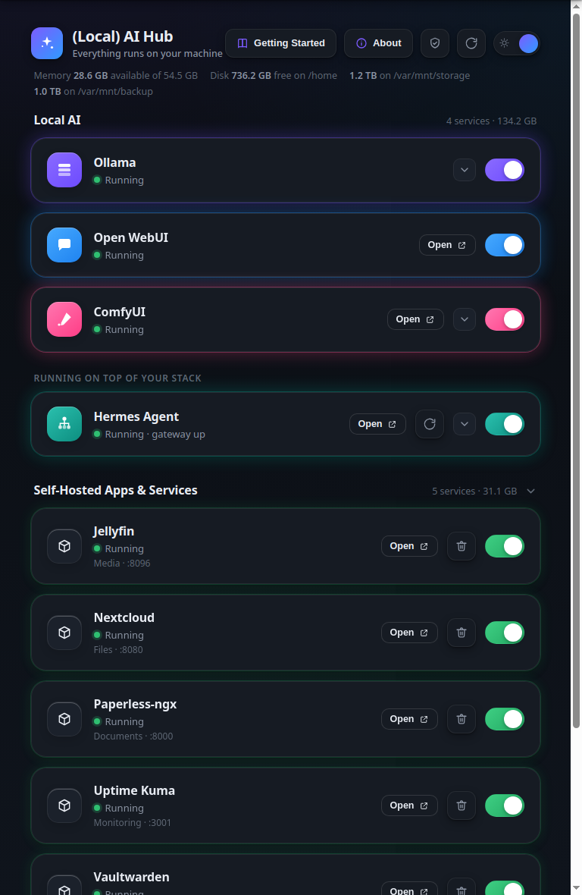
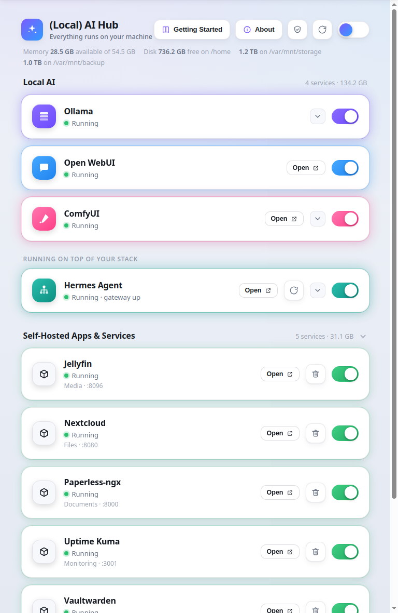
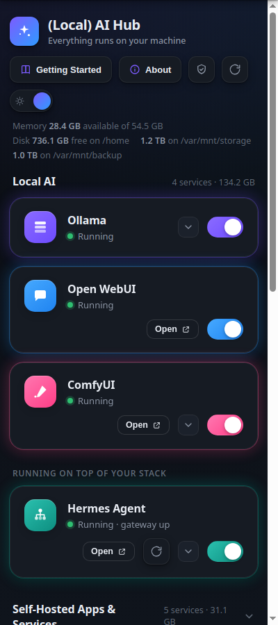

<h1 align="center">Local AI Hub</h1>

<p align="center">
  A desktop control panel for what you self-host on your own machine.
  <b>Local AI</b> first — <a href="https://ollama.com">Ollama</a>,
  <a href="https://openwebui.com">Open&nbsp;WebUI</a>,
  <a href="https://github.com/comfyanonymous/ComfyUI">ComfyUI</a>, and agent harnesses on top —
  and below it <b>Local Apps &amp; Services</b>, whatever else you run in rootless Podman,
  found automatically. Start/stop each one, watch live status, manage models,
  and see the address that actually works from your phone.
</p>

<p align="center">
  <a href="LICENSE"></a>
  
  
  
</p>

<p align="center">
  
  &nbsp;
  
</p>
<p align="center">
  
  <br>
  <sub>The stacked layout at a narrow width — the same place the LAN and Tailscale addresses matter most.</sub>
</p>

> **Everything stays local. No accounts, no telemetry, no analytics, nothing phones home.**
> The only outbound actions are the "browse models" links, model updates, and the
> "check for a newer version" button — each of which contacts one host, only when you click it.

---

## ⚙️ Tested on

This is built and proven on one specific configuration:

- **Distro:** Bazzite (Fedora Atomic base, KDE)
- **Hardware:** AMD Ryzen AI MAX+ 395 "Strix Halo", Radeon 8060S iGPU (**gfx1151**)
- **Services:** Ollama · Open WebUI · ComfyUI

Other distros, GPUs, or AI tools **aren't supported yet** — not a promise they won't be,
just an honest label. The app's built-in **Setup Check** detects whether your machine
matches and skips the checks plainly if it doesn't.

## 🚀 New here? Start with the guide

**→ [docs/GETTING_STARTED.md](docs/GETTING_STARTED.md)** — a from-scratch setup for the same
Bazzite + Strix Halo hardware, with two tracks: one for people using an AI assistant, and a
full manual walkthrough (every command verified against a working machine).

## ✨ Features

- **Two clear groups** — **Local AI** on top (the tools this app is about), **Local Apps & Services** below. The second group collapses, and starts collapsed past six services, so a big homelab never buries the AI stack.
- **Your other self-hosted services, found automatically** — the app asks Podman what's actually running rather than checking a list of supported names, so your Jellyfin or Nextcloud shows up the same way. Well-known services get a proper label; anything else is shown honestly by container name and port. Pods collapse to one entry, and containers you ran by hand stay out.
- **One toggle per service** — start/stop anything in either group (systemd `--user`), live status from a real liveness check, not just "the container exists".
- **Open in browser** — one click to each running web UI, always via `127.0.0.1` (never `localhost`).
- **Reachable at** — the address that works from your *phone*. The app detects what this machine actually has (LAN, Tailscale with its MagicDNS name) and shows each one with a plain-language note about where it works. Nothing is invented; undetected means not shown.
- **Ollama model manager** — installed models with size, an **in-memory vs on-disk** badge, and a real `ollama pull` **Update**.
- **ComfyUI model manager** — lists what's in your model folders by type; **install** new models from a Hugging Face / Civitai / direct link (download → verify → filed in the right folder); per-model **Update** once a source is set.
- **Setup Check** — one panel that verifies the iGPU flags, the Open WebUI Quadlet, the gfx1151 ROCm build, and the GGUF node — with safe one-click fixes.
- **Crash-aware** — a service that dies shows **"Stopped unexpectedly"** with a **View log** button, not a silent gray.
- **Live rescan** — auto + manual, so hand-added models appear without a restart.
- **Notices installs and uninstalls while it's running** — install or remove a tool by any method and the card updates itself; the honest "Not installed" state appears and disappears without a restart. Driven by systemd D-Bus signals and filesystem watches, not by constant rescanning.
- **Agent layers** — a harness that runs *on top of* your stack (currently [Hermes Agent](https://github.com/NousResearch/hermes-agent)) gets its own labelled section rather than being mixed in with the base services, so it's obvious what's an engine (Ollama), what's an interface (Open WebUI), and what's an agent on top. The card states its dependency in place, shows the model and context it's configured against, and flags it clearly if that model isn't installed.
- **Check for a newer version of the app** — in About, and only when you press it. No launch check, no background timer. Flatpak installs are pointed at their app store; the app never updates itself.
- **Light & dark** — polished, and your choice persists.

## 🖥️ Run it

```bash
python3 -m venv .venv
source .venv/bin/activate
pip install -r requirements.txt
python app.py
```

**Add it to your app launcher** (icon + pinnable, no terminal):

```bash
bash scripts/install-desktop.sh
```

This renders the app icon into `~/.local/share/icons` and installs a `.desktop`
entry that runs the app through the venv — double-clicking just works.

## 🏗️ Architecture

- **UI** — a local web front-end (`web/`) in a `QWebEngineView` (PySide6 + QtWebEngine), wired to Python over `QWebChannel`.
- **Backend** — `hub/services/` controls each service via `systemctl --user` + HTTP probes; Ollama uses its REST API, ComfyUI model provenance/updates live in `hub/services/comfy_models.py`. Stdlib only.
- **Layers** — `hub/layers/` holds harnesses that run on top of a base service. A `Layer` is a `Service` plus the key of what it depends on, so control and status are inherited; adding another harness means a subclass and one line in `LAYER_CLASSES`.
- **Change detection** — `hub/services/watch.py` reconciles on systemd D-Bus signals and inotify rather than polling for installs.
- **Discovery** — `hub/services/containers.py` enumerates rootless Podman containers, keyed on the `PODMAN_SYSTEMD_UNIT` label Quadlet writes; that label is also what start/stop uses, so discovered services go through the same `Service` class (and the same Flatpak D-Bus path) as everything else.
- **Addresses** — `hub/addresses.py` reads interfaces through an ioctl over the stdlib rather than shelling out to `ip`, so it works with no external binary.
- **Adapting to another machine** — service unit names and ports are in `hub/services/*.py` (`unit=` / `health_url=`).

## 📄 License

Local AI Hub is **free and open source** under the [GNU Affero General Public License v3.0](LICENSE)
(AGPLv3). You're free to use it commercially, fork it, and modify it — but if you modify it and run
it as a hosted or networked service, AGPLv3 requires you to release your modified source too. That
deliberately closes the loophole a permissive license leaves open for closed, hosted forks.

Release history is in **[CHANGELOG.md](CHANGELOG.md)**.

## 💬 Connect

- 📺 **YouTube** — [youtube.com/@kamsiob](https://youtube.com/@kamsiob)
- 💻 **GitHub** — [github.com/kamsiob](https://github.com/kamsiob)
- 🌐 **Website** — [kamsiob.com](https://kamsiob.com)
- 💬 **Telegram (Kamsiob Lab)** — [t.me/+g5LKm9rUnNcxMjk5](https://t.me/+g5LKm9rUnNcxMjk5)
- ✉️ **Feedback** — [hello@kamsiob.com](mailto:hello@kamsiob.com)

Same links live inside the app, under **About** in the header.

## ☕ Support this project

Local AI Hub is free and always will be. If it's useful to you and you'd like to help
keep it going, you can buy me a coffee — entirely optional, always appreciated.

<p align="center">
  <a href="https://buymeacoffee.com/kamsiob">
    
  </a>
</p>

---

<p align="center">
  Made by <b>Kamsiob</b> ·
  <a href="https://youtube.com/@kamsiob">YouTube</a> ·
  <a href="https://github.com/kamsiob">GitHub</a> ·
  <a href="https://kamsiob.com">Website</a> ·
  <a href="https://t.me/+g5LKm9rUnNcxMjk5">Telegram</a> ·
  <a href="mailto:hello@kamsiob.com">hello@kamsiob.com</a>
</p>
